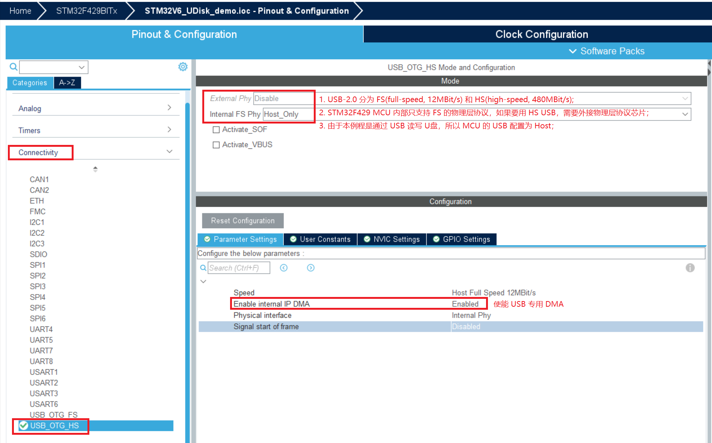
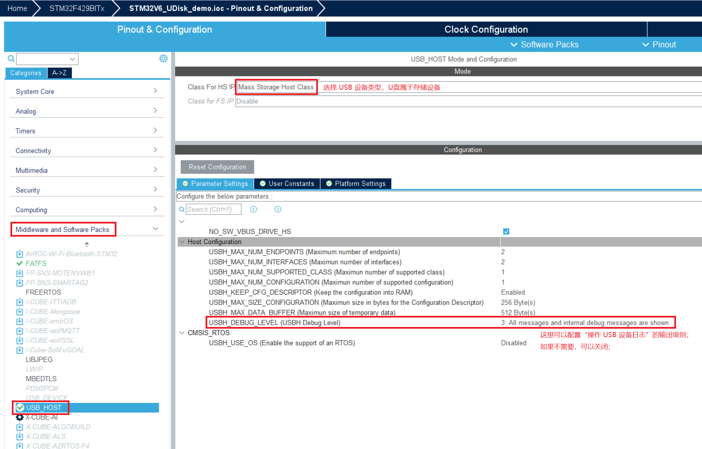

## 功能说明
1. 通过`USB`端口读写`U盘`文件；

## 配置说明
1. 在`cubeMx -> Connectivity -> USB_OTG_HS`中配置`USB`相关参数：

2. 在`cubeMx -> Middleware and Software Packs -> FATFS`中配置`fatfs`相关参数；只需选择存储设备`USB Disk`，其他保持默认即可；
3. 在`cubeMx -> Middleware and Software Packs -> USB_HOST`中配置`USB HOST`相关参数：

4. `MCU`时钟配置（`USB`需要配置为 `48MHz`）；
5. 通过`cubeMx`生成工程；
6. 由于在`步骤3`中，开启了`USB`日志，而生成的代码默认通过`printf`输出日志；所以要么将`printf`改为自己的日志输出接口，或者重定向`printf`：
```c
#if (USBH_DEBUG_LEVEL > 0U)
#include "dbger.h"
#define  USBH_UsrLog(...)   do { \
                            LOG_DBG(__VA_ARGS__); \
                            LOG_DBG("\n"); \
} while (0)
#else
#define USBH_UsrLog(...) do {} while (0)
#endif

#if (USBH_DEBUG_LEVEL > 1U)
#define  USBH_ErrLog(...) do { \
                            LOG_DBG("ERROR: "); \
                            LOG_DBG(__VA_ARGS__); \
                            LOG_DBG("\n"); \
} while (0)
#else
#define USBH_ErrLog(...) do {} while (0)
#endif

#if (USBH_DEBUG_LEVEL > 2U)
#define  USBH_DbgLog(...)   do { \
                            LOG_DBG("DEBUG : "); \
                            LOG_DBG(__VA_ARGS__); \
                            LOG_DBG("\n"); \
} while (0)
#else
#define USBH_DbgLog(...) do {} while (0)
#endif
```
6. `USB`的整个初始化及工作流程，是一个状态机；通过状态的改变，触发不同的操作；主要代码如下：
```c
// usb_host.c
static void USBH_UserProcess  (USBH_HandleTypeDef *phost, uint8_t id)
{
  /* USER CODE BEGIN CALL_BACK_1 */
    switch(id)
    {
		case HOST_USER_SELECT_CONFIGURATION:
			LOG_DBG("HOST_USER_SELECT_CONFIGURATION\n");
			break;
		
		case HOST_USER_CLASS_ACTIVE:
			LOG_DBG("HOST_USER_CLASS_ACTIVE\n");
			Appli_state = APPLICATION_START;
			break;
		
		case HOST_USER_CLASS_SELECTED:
			LOG_DBG("HOST_USER_CLASS_SELECTED\n");
			break;
		
		case HOST_USER_CONNECTION:
			LOG_DBG("HOST_USER_CONNECTION\n");
			break;	
		
		case HOST_USER_DISCONNECTION:
			LOG_DBG("HOST_USER_DISCONNECTION\n");
			Appli_state = APPLICATION_IDLE;
			f_mount(NULL, (TCHAR const*)"", 0);  
			break;

		case HOST_USER_UNRECOVERED_ERROR:
			LOG_DBG("HOST_USER_UNRECOVERED_ERROR\n");
			break; 

		default:
			LOG_DBG("USBH_UserProcess default\n");
			break;
    }
  /* USER CODE END CALL_BACK_1 */
}

// main.c
while (1)
{
	static uint32_t last_tick = 0;
	uint32_t now = HAL_GetTick();
    /* USER CODE END WHILE */
    MX_USB_HOST_Process();

    /* USER CODE BEGIN 3 */
	switch(Appli_state)
    {
        case APPLICATION_START:
		    LOG_DBG("APPLICATION_START\n");
            MSC_Application();      // USB read/write
            Appli_state = APPLICATION_IDLE;
            break;
        
        case APPLICATION_IDLE:
			//LOG_DBG("APPLICATION_IDLE\n");
			if(now - last_tick > 3000) {
				last_tick = now;
				LOG_DBG("set Appli_state to START\n");
				MSC_Application();      // USB read/write
			}
			break;
			
		case APPLICATION_READY:
			LOG_DBG("APPLICATION_READY\n");
			break;
			
		case APPLICATION_DISCONNECT:
			LOG_DBG("APPLICATION_DISCONNECT\n");
			break;
			
        default:
            break;      
    }
}
```